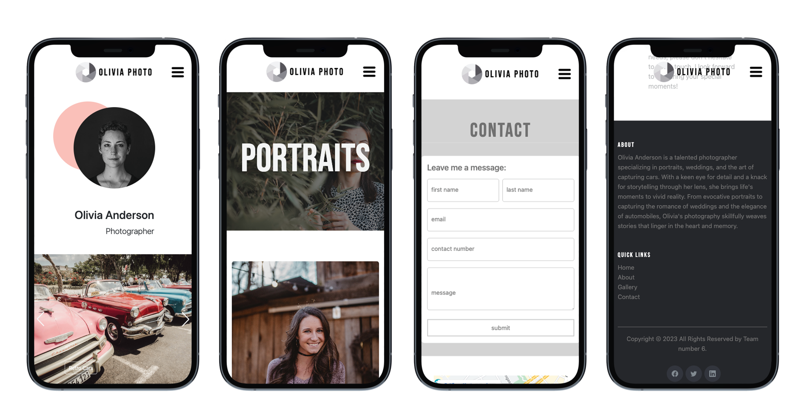

# Portfolio Website for a Photographer

<!-- ... It's also responsive. -->

# Collaborators

[Halil Tas](https://github.com/Halil-Tas) 
[Isabel Strauch](https://github.com/isa-stra) 
[Christian Runda](https://github.com/veganchris) 
[Dmitrii Malyshkin](https://github.com/DmitriiMal)

## Was built with:
 
  
  
  

  ## You may test it here

## Screenshots

  
  
 
 
 
 
 
